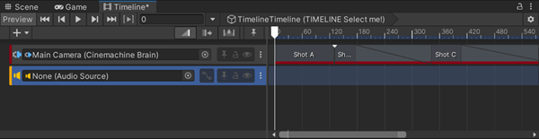
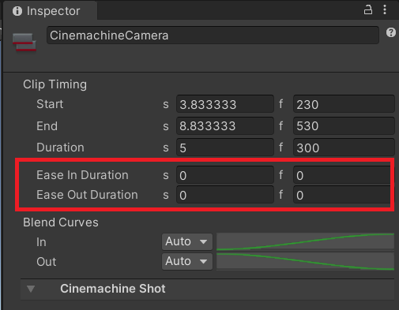

# Cinemachine and Timeline

Use [Timeline](https://docs.unity3d.com/Packages/com.unity.timeline@latest) to activate, deactivate, and blend between CinemachineCameras when you need to produce a predictable shot sequence with choreographed cameras.

**Tip**: For simple shot sequences, you can also use a [Cinemachine Sequencer Camera](CinemachineSequencerCamera.md) instead of Timeline.

## Live Cinemachine Camera selection

When Timeline drives Cinemachine, it overrides the priority-based decisions made by the [Cinemachine Brain](CinemachineBrain.md). When the Timeline finishes, or at least when Timeline is not currently driving Cinemachine, the control [returns to the Cinemachine Brain](concept-camera-control-transitions.md).

## Cinemachine Track and Shot Clips

Timeline controls Cinemachine Cameras via **Cinemachine Shot Clips** in a **Cinemachine Track**. Each shot clip points to a CinemachineCamera to activate and then deactivate. Use a sequence of shot clips to specify the order and duration of each shot.

## Cinemachine Camera transitions

To cut between two CinemachineCameras, place the clips next to each other.

To blend between two CinemachineCameras, overlap the clips.

## Multiple Cinemachine Tracks

You can have multiple Cinemachine Tracks in the same Timeline. The tracks lower down in the Timeline override any tracks higher up.

By having a shot on a lower track become active while a higher-up CinemachineShot clip is active, you can interrupt the shot with another one.

It's also possible to have multiple Timelines with Cinemachine tracks.  In this case, the Timeline that was most recently activated overrides the others, with control reverting to the previous Timeline in places where the overriding Timeline has no Cinemachine Camera Clips active.

## Blend with other Cinemachine Tracks and the Brain

You can blend a Cinemachine Shot Clip with another one that is in a separate Cinemachine Track, or even with the Cinemachine Camera currently identified as the Live one by the Cinemachine Brain.

For this, change the **Ease In Duration** and **Ease Out Duration** time values of the clip in the Inspector.

## Additional resources

* [Set up Timeline with Cinemachine Cameras](setup-timeline.md)