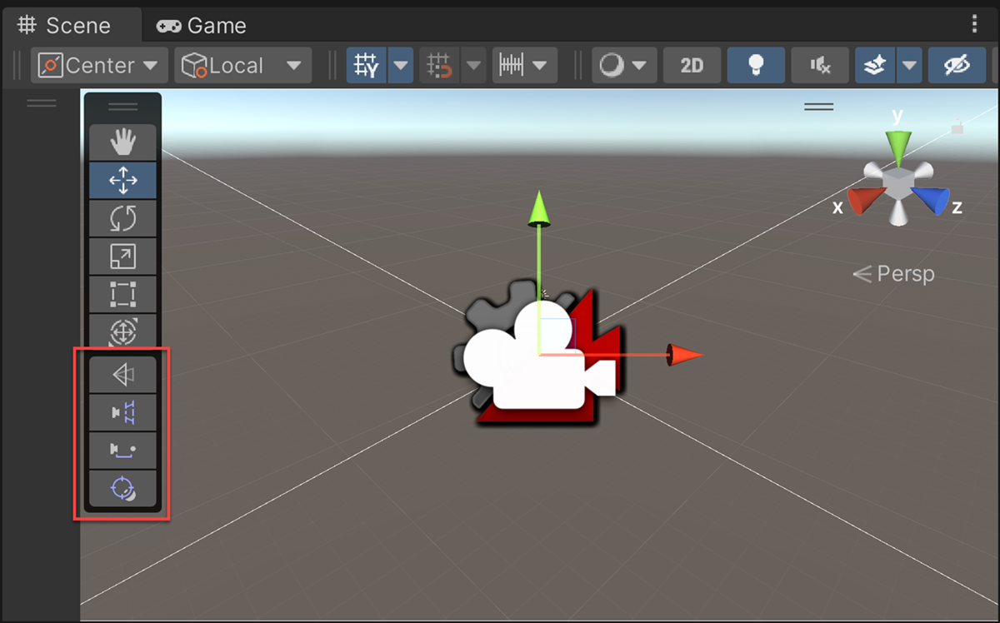
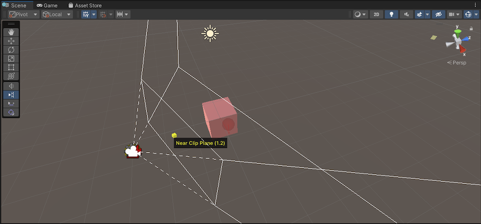

# Cinemachine Handle toolbar

The Cinemachine Handle toolbar is a group of 3D controls that allow you to manipulate CinemachineCamera parameters visually in the Scene view. You can use the handle tools to interactively adjust the selected object's parameters quickly and efficiently rather than controlling them via the inspector.

The toolbar automatically appears in the Scene view **toolbar** Overlay when you select a type of CinemachineCamera with an associated handle.

## Handle tools

The following four Handle tools are available in the toolbar:

**1. Field of View (FOV)**

The FOV tool can adjust Vertical FOV, Horizontal FOV, Orthographic Size, or Focal Length depending on what's selected by the user. It can control:

* Vertical or Horizontal FOV (depending on the selection in the Main Camera) when the camera is in Perspective mode.
* Orthographic Size when the camera is in Orthographic mode.
* Focal length when the camera is in Physical mode.

For more information on the Field of View (FOV) property see, [Setting CinemachineCamera properties](CinemachineCamera.md).

**2. Far/Near clip planes**

* You can drag the points to increase the far clip plane and near clip plane.

For more information on the Far and Near clip plane properties see, [Setting CinemachineCamera properties](CinemachineCamera.md).

**3. Follow offset**

The Follow offset is an offset from the Follow Target. You can drag the points to increase or decrease the Follow offset position.

For more information on the Follow offset property see, [Orbital Follow properties](CinemachineFollow.md).

**4. Tracked object offset**

This starts from where the camera is placed. You can drag the points to increase or decrease the tracking target position when the desired area isn't the tracked object’s center.

For more information on the Tracked object offset property see, [Rotation Composer properties](CinemachineRotationComposer.md).

