When following a target with an offset from the target, the binding mode defines the coordinate space Unity uses to interpret the camera offset from the target and to apply the damping.
  

### Lock To Target

Makes the CinemachineCamera use the local frame of the Follow target. When the target rotates, the camera rotates with it to maintain the offset and to maintain the same view of the target.

| Start | Pitch, 45 degrees |
| :--- | :--- |
| 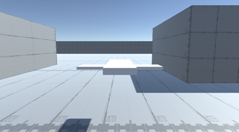 | 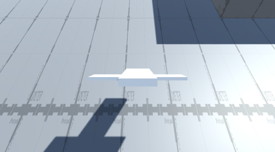 |

| Yaw, 45 degrees | Roll, 45 degrees |
| :--- | :--- |
| 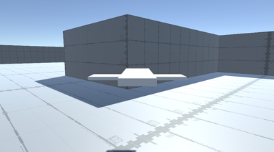 | 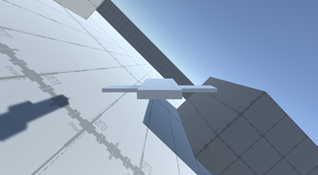 |

  
### Lock To Target No Roll

Makes the CinemachineCamera use the local frame of the Follow target, with roll set to 0.

| Start | Pitch, 45 degrees |
| :--- | :--- |
| 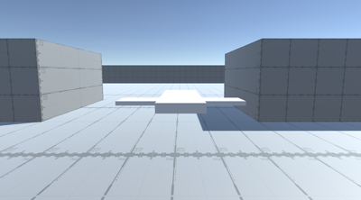 | 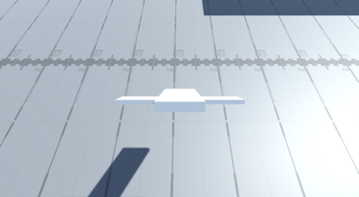 |

| Yaw, 45 degrees | Roll, 45 degrees |
| :--- | :--- |
|  | 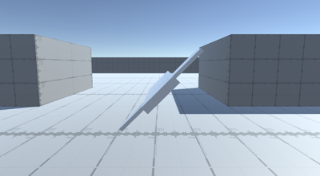 |

  
### Lock To Target On Assign

Makes the orientation of the CinemachineCamera match the local frame of the Follow target, at the moment when the CinemachineCamera is activated or when the target is assigned. This offset remains constant in world space. The camera does not rotate along with the target.

| Start | Pitch, 45 degrees |
| :--- | :--- |
| 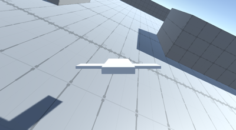 | 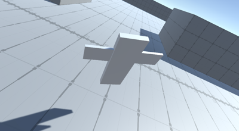 |

| Yaw, 45 degrees | Roll, 45 degrees |
| :--- | :--- |
| 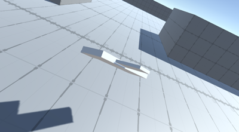 | 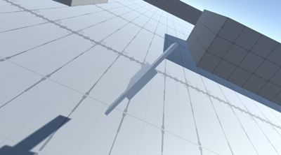 |

  
### Lock To Target With World Up

Makes the CinemachineCamera use the local frame of the Follow target with tilt and roll set to 0. This binding mode ignores all target rotations except yaw.

| Start | Pitch, 45 degrees |
| :--- | :--- |
| 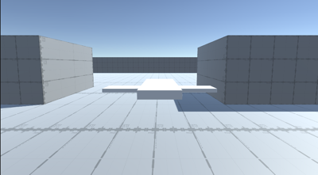 | 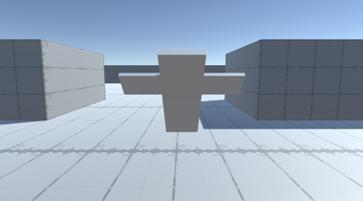 |

| Yaw, 45 degrees | Roll, 45 degrees |
| :--- | :--- |
| 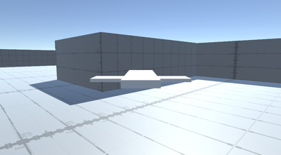 |  |

  
### World Space

The offset is interpreted in world space relative to the origin of the Follow target. The camera will not change position when the target rotates.

| Start | Pitch, 45 degrees |
| :--- | :--- |
| 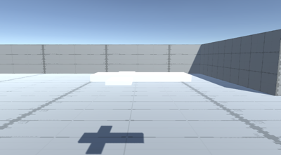 | 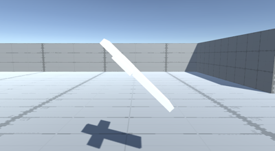 |

| Yaw, 45 degrees | Roll, 45 degrees |
| :--- | :--- |
| 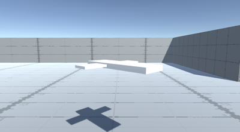 | 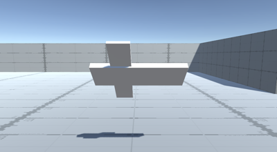 |

  
### Lazy Follow

Lazy follow interprets the offset and damping values in camera-local space. This mode emulates the action a human camera operator would take when instructed to follow a target.

The camera attempts to move as little as possible to maintain the same distance from the target; the direction of the camera with respect to the target does not matter. Regardless of the orientation of the target, the camera tries to preserve the same distance and height from it.

| Start | Pitch, 45 degrees |
| :--- | :--- |
| 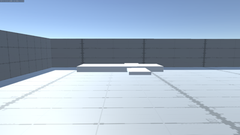 | 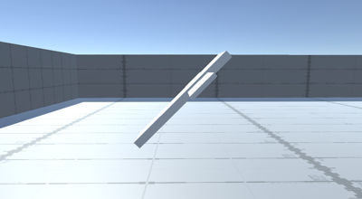 |

| Yaw, 45 degrees | Roll, 45 degrees |
| :--- | :--- |
| 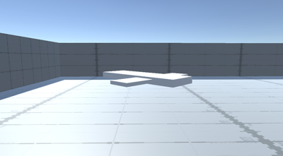 | 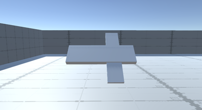 |
