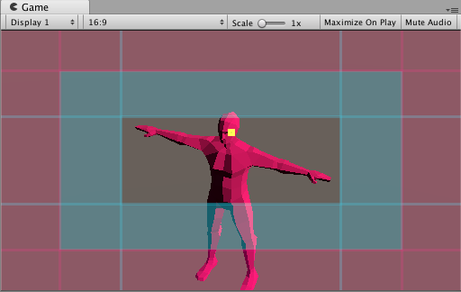

This component defines areas in the camera frame for you to compose a shot:

* __Dead zone__: The area of the frame in which Cinemachine keeps the target. The target can move within this region and the CinemachineCamera will not adjust to reframe it until the target leaves the dead zone.

* __Soft zone__: If the target enters this region of the frame, the camera will adjust to put it back in the dead zone. It will do this slowly or quickly, according to the time specified in the Damping settings.

* __Screen Position__: The screen position of the center of the dead zone.  0 is the center of the screen, +1 and -1 are the edges.

* __Damping__: Simulates the lag that a real camera operator introduces while operating a heavy physical camera. Damping specifies how quickly or slowly the camera reacts when the target enters the __soft zone__ while the camera tracks the target. Use small numbers to simulate a more responsive camera, rapidly moving or aiming the camera to keep the target in the __dead zone__. Larger numbers simulate heavier cameras, The larger the value, the more Cinemachine allows the target to traverse the soft zone.

The __Game View Guide__ gives an interactive, visual indication of these areas. The guides appear as tinted areas in the [Game view](https://docs.unity3d.com/Manual/GameView.html).

The clear area indicates the __dead zone__. The blue-tinted area indicates the __soft zone__. The __Screen Position__ is the center of the __Dead Zone__. The red-tinted area indicates the __no pass__ area, which the camera prevents the target from entering. The yellow square indicates the target itself.

Adjust these areas to get a wide range of camera behaviors. To do this, drag their edges in the Game view or edit their properties in the Inspector window. For example, use a larger __soft zone__ for a fast-moving target, or enlarge __dead zone__ to create an area in the middle of the camera frame that is immune to target motion. Use this feature for things like animation cycles, where you don’t want the camera to track the target if it moves just a little.

