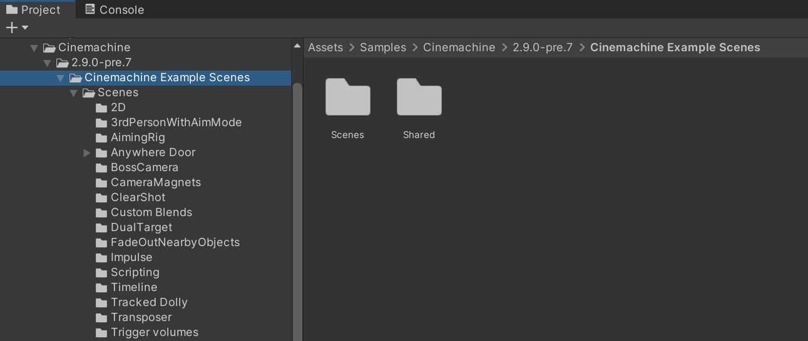

# About Cinemachine

Cinemachine is a suite of modules for operating the Unity camera. Cinemachine solves the complex mathematics and logic of tracking targets, composing, blending, and cutting between shots. It is designed to significantly reduce the number of time-consuming manual manipulations and script revisions that take place during development.

The procedural nature of these modules makes Cinemachine bug-resistant. When you make adjustments—for example, change an animation, vehicle speed, terrain, or other GameObjects in your Scene—Cinemachine dynamically adjusts its behavior to make the best shot. There is no need, for example, to re-write camera scripts just because a character turns left instead of right.

Cinemachine works in real time across all genres including FPS, third person, 2D, side-scroller, top down, and RTS. It supports as many shots in your Scene as you need. Its modular system lets you compose sophisticated behaviors.

Cinemachine works well with other Unity tools, acting as a powerful complement to Timeline, animation, and post-processing assets. Create your own [extensions](CinemachineVirtualCameraExtensions.md) or integrate it with your custom camera scripts.

## Installing Cinemachine

Cinemachine is a free package, available for any project. You install Cinemachine like [any other package](https://docs.unity3d.com/Packages/com.unity.package-manager-ui@latest/index.html).

After you install Cinemachine, a new __GameObject > Cinemachine__ menu is available. You can also access this menu when you right-click inside the Hierarchy view.

## Requirements

Cinemachine has few external dependencies. Just install it and start using it. If you are also using the Post Processing via HDRP or URP volumes, then adapter modules are provided - protected by `ifdef` directives which auto-define if the presence of the dependencies is detected.  

There are similar `ifdef`-protected behaviours for other packages, such as Timeline and UGUI.

This version of Cinemachine is supported by the following versions of the Unity Editor:

* 2023.1 and later

### Upgrading from previous versions of Cinemachine

Cinemachine 3.0 is a major version change from CM 2.X, and the API and data format have changed significantly. Scripts written for the CM 2.X API are unlikely to run with 3.X without manual intervention. Also, the CM Camera instances in your project will themselves need upgrading.

While it is possible to upgrade an existing project from CM 2.X, you should think carefully about whether you are willing to put in the work. It might be better in many cases just to stick with CM 2.X, which will continue to be supported for a while in parallel with CM 3.X.  If you do choose to upgrade your project, please see the upgrade guide located [here](CinemachineUpgradeFrom2.md).

### Upgrading from the old Asset Store version of Cinemachine

If you already installed a very old version of Cinemachine from the Unity Asset Store, you should upgrade to the Cinemachine Package. It is recommended in this case to upgrade to Cinemachine 2.X, which in most cases is completely automatic.

To upgrade to the Cinemachine Package:

1. In Unity Editor, 2019.4+ or later, open your project.

2. Save the current Scene you are working on.

3. Create a new, empty Scene.

4. In the [Project window](https://docs.unity3d.com/Manual/ProjectView.html), delete the Cinemachine Asset and any CinemachinePostProcessing adaptor assets you may have installed.

5. Install the Cinemachine 2.X package.

### Importing samples

**Cinemachine** includes example scenes that demonstrate how to use the features in real-world scenarios. 

To import **Cinemachine** samples to your project: 

1. Navigate to **Window > Package Manager**. 

2. Locate **Cinemachine** in the list of available packages, and select it. Under the package description, there is a list of available example scenes under **Samples**. 

3. Select **Import** to download and install the example scenes and assets.

Unity places imported samples in your Project's Asset folder under **Assets > Samples > Cinemachine > [version number] > Cinemachine Example Scenes**.

