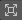

# Preview and author a Cinemachine Camera in first person

> [!NOTE]
> The following tasks require the use of Unity's [Cameras overlay](https://docs.unity3d.com/Manual/cameras-overlay.html). To benefit from the full functionality described in this page, you have to use Unity 6.0 or later.

* Browse through all your Cinemachine Cameras and [quickly preview their shot composition](#preview-a-cinemachine-camera-shot) without having to manage camera activations from a Cinemachine Brain perspective.

* Temporarily manage navigation in the Scene view directly through the lens of a Cinemachine Camera to [adjust its shot composition](#author-a-cinemachine-camera-shot).

## Preview a Cinemachine Camera shot

To preview the scene through the lens of a Cinemachine Camera:

1. From the Scene view, use the [Overlays menu](https://docs.unity3d.com/Manual/overlays.html) to display the Cameras overlay.

1. Use the drop-down to select the targeted Cinemachine Camera.

> [!TIP]
> * Use distinctive names for each GameObject that includes a Cinemachine Camera component.
> * Resize the Camera overlay if you need to see more or less details in the preview.

## Author a Cinemachine Camera shot

To author a Cinemachine Camera shot in first person:

1. In the Scene view, use the Cameras overlay to [select the targeted Cinemachine Camera](#preview-a-cinemachine-camera-shot).

1. Select  **Control selected camera in first person**.

1. Move and rotate the view with the [Scene view navigation controls](https://docs.unity3d.com/Manual/SceneViewNavigation.html#tools).
   
   > [!NOTE]
   > When you navigate through the scene with a Cinemachine Camera, Unity automatically adjusts or blocks some movements to preserve the constraints related to the expected Cinemachine Camera behavior.

1. In the Cameras Overlay, select  **Open Camera component properties** to edit, for example, the camera Lens properties.
   
   The window that opens allows you to edit any property of the [Cinemachine Camera component](CinemachineCamera.md).
   
   > [!NOTE]
   > You shouldn't edit **Procedural Components** and use **Add Extensions** from this window, which can't show the additional component changes that would result. Instead, select the GameObject and make the edits from the Inspector window.

1. When you're satisfied with your shot composition:
   
   * Close the Camera properties window if you opened it.
   * Select  **Return to Scene Camera**.

   > [!WARNING]
   > Don't skip this last step before you go navigate the scene to perform another task, otherwise you'll lose the Cinemachine Camera edits you just made.

## Additional resources

* [Set up a basic Cinemachine environment](setup-cinemachine-environment.md)
* [Set up multiple Cinemachine Cameras and transitions](setup-multiple-cameras.md)

