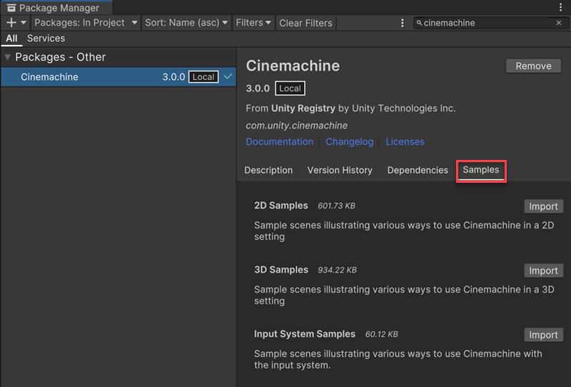
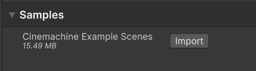

## Import samples to your project

To import a **Cinemachine** sample to your project: 

1. Open the Package manager: from the Editor's menu, select **Window** > **Package Manager**.

2. Locate **Cinemachine** in the list of available packages, and select it.

3. In Package Manager's right pane, select the **Samples** tab.

   

4. Choose a sample in the [list](samples-tutorials.md#samples) and select **Import** to download and install the corresponding example Scenes and Assets.

   Unity places imported samples in your Project's Asset folder under **Assets** > **Samples** > **Cinemachine** > **_[version number]_**.

   

5. To explore a specific Cinemachine use case or configuration, open a Scene in one of the available subfolders, and enter Play mode to test it.