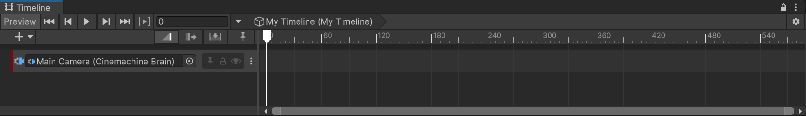
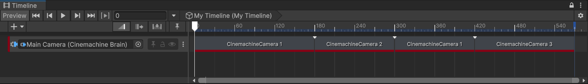

# Set up Timeline with Cinemachine Cameras

Set up [Timeline in a Cinemachine environment](concept-timeline.md) to choreograph Cinemachine Cameras and produce a predictable shot sequence:

* Prepare multiple Cinemachine Cameras to support the various shots,
* Prepare a Timeline, create a Cinemachine Track, and add Cinemachine Shot Clips, and
* Manage camera cuts and blends.

## Prepare the Cinemachine Cameras

1. In the Hierarchy, create a few [static](setup-cinemachine-environment.md) or [procedural](setup-procedural-behavior.md) Cinemachine Cameras with different properties according to the shots you want to get.

2. Name the Cinemachine Cameras in a way you can easily identify them in the future.

## Prepare the Timeline

1. Create an empty GameObject in your Scene: from the Editor's menu, select **GameObject** > **Create Empty**.

2. Give this empty GameObject a descriptive name, for example, "My Timeline".

3. Open the [Timeline](https://docs.unity3d.com/Packages/com.unity.timeline@latest) window if it's not already open, and **Create** a Timeline Asset and instance for "My Timeline" GameObject.

4. Click the padlock button to lock the Timeline window and make it easier to add and adjust tracks.

5. If needed, add tracks that control the subjects of your Scene. For example, add an Animation track to animate your main character.

## Create a Cinemachine Track with Cinemachine Shot Clips

1. From the Hierarchy, drag the Unity Camera GameObject that includes a Cinemachine Brain component onto the Timeline Editor, then select **Create Cinemachine Track**.

   Unity adds a Cinemachine Track targeting the Unity Camera in Timeline.

2. From the Hierarchy, drag a first Cinemachine Camera GameObject onto the added Cinemachine Track.

   Unity adds to the Cinemachine Track a Cinemachine Shot Clip targeting the Cinemachine Camera you selected.

3. Repeat the previous step as many times as needed with other Cinemachine Cameras to get additional Cinemachine Shot Clips in the Cinemachine Track.

   > [!NOTE]
   > You can reuse the same Cinemachine Camera several times in separate Cinemachine Shot Clips placed at different times in the Cinemachine Track.

4. Adjust the order and duration of Cinemachine Shot Clips according to the desired shot sequence.

## Create camera cuts

To produce a camera [cut](concept-camera-control-transitions.md#cuts) between two shots:

* Place the two Cinemachine Shot Clips or edit their boundaries so that the clips stick to each other without overlapping.

## Create camera blends

To make the Cinemachine Cameras [blend](concept-camera-control-transitions.md#blends) their properties between two shots:

* Move the two Cinemachine Shot Clips or edit their boundaries so that the clips overlap.

   The resulting overlap area defines the blend duration.

