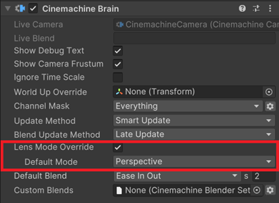

# What's new in Cinemachine 3

This page describes the main new features and changes in Cinemachine 3.

## Major API changes

The Cinemachine 3 API has been changed in depth to comply with Unity standards and align with the rest of the Engine. 

Some components have been replaced by new components, others have been renamed. Field names have changed. Namespaces have changed.

> [!NOTE]
> For most of these issues, if you [upgrade from Cinemachine 2.x](CinemachineUpgradeFrom2.md), you will see errors or deprecation warnings in the console, which will point you to the areas in your code that need attention. 

### New namespaces

Namespaces have changed to be more consistent with Unity standards.

| In Cinemachine 2.x | In Cinemachine 3.x |
| :--- | :--- |
| `Cinemachine` | `Unity.Cinemachine` |
| `Cinemachine.Editor` | `Unity.Cinemachine.Editor` |
| `Cinemachine.Utility` | Folded into `Unity.Cinemachine` |

### New components with clearer names

Several components have been replaced by new components.

> [!NOTE]
> These are not renames, they are new component types. The old components still exist but are deprecated. If your scripts refer to any of them, they will need to be updated once the data upgrade has been done.

| In Cinemachine 2.x | In Cinemachine 3.x |
| :--- | :--- |
| CinemachineVirtualCamera | [CinemachineCamera](CinemachineCamera.md) (see the Note below) |
| CinemachineFreeLook | [CinemachineCamera](CinemachineCamera.md) (see the Note below) |
| CinemachinePath and CinemachineSmoothPath | Spline Container, provided by Unity's new native spline implementation. |
| CinemachineDollyCart | [CinemachineSplineCart](CinemachineSplineCart.md) |
| CinemachineTransposer | [CinemachineFollow](CinemachineFollow.md) |
| CinemachineOrbitalTransposer | [CinemachineOrbitalFollow](CinemachineOrbitalFollow.md) |
| CinemachineFramingTransposer | [CinemachinePositionComposer](CinemachinePositionComposer.md) |
| CinemachineComposer | [CinemachineRotationComposer](CinemachineRotationComposer.md) |
| CinemachinePOV | [CinemachinePanTilt](CinemachinePanTilt.md) |
| CinemachineTrackedDolly | [CinemachineSplineDolly](CinemachineSplineDolly.md) |
| CinemachineGroupComposer | [CinemachineGroupFraming](CinemachineGroupFraming.md) extension used in conjunction with [CinemachineRotationComposer](CinemachineRotationComposer.md) |
| CinemachineCollider | [CinemachineDeoccluder](CinemachineDeoccluder.md) |
| CinemachineConfiner | [CinemachineConfiner2D](CinemachineConfiner2D.md) and [CinemachineConfiner3D](CinemachineConfiner3D.md) |
| Cinemachine3rdPersonFollow | [CinemachineThirdPersonFollow](CinemachineThirdPersonFollow.md) |
| CinemachineSameAsFollowTarget | [CinemachineRotateWithFollowTarget](CinemachineRotateWithFollowTarget.md) |

> [!NOTE]
> The new `CinemachineCamera` class that replaces `CinemachineVirtualCamera` and `CinemachineFreeLook` inherits from `CinemachineVirtualCameraBase`.

### Renamed components

The following components have been simply renamed.

| In Cinemachine 2.x | In Cinemachine 3.x |
| :--- | :--- |
| Cinemachine3rdPersonAim | [CinemachineThirdPersonAim](CinemachineThirdPersonAim.md) |
| CinemachineBlendListCamera | [CinemachineSequencerCamera](CinemachineSequencerCamera.md) |

### Renamed Fields 

The old convention of using `m_FieldName` has been changed to follow Unity's latest naming conventions. Consequently, all of the `m_` prefixes have been removed from field names, everywhere.

> [!NOTE]
> If you [upgrade from Cinemachine 2.x](CinemachineUpgradeFrom2.md) and your scripts no longer compile because of this, the first remedy is to remove the `m_` from the field name that your script is referencing. Most of the time, that will be enough.

Occasionally, some field names were changed more significantly. It should be fairly easy to find the appropriate replacements.

The `SimpleFollowWithWorldUp` binding mode has been renamed to `LazyFollow`.

### Removed CinemachineCore.Instance

Most methods and properties that used to be accessed via the `CinemachineCore.Instance` singleton are now direct static methods and properties on `CinemachineCore`.

There are some exceptions, notably `ActiveBrainCount` and `GetActiveBrain()` which are now static methods in `CinemachineBrain`.

## Other architecture and integration changes

Beyond API changes, Cinemachine 3 includes other architecture and integration changes that improves its alignment with the rest of the Unity Editor.

### Cleaner Object Structure, No Hidden GameObjects

Cinemachine 2.x implemented the Cinemachine pipeline on a hidden GameObject child of the Virtual Camera named "cm".

This has been removed in Cinemachine 3.x, and Cinemachine pipeline components (such as OrbitalFollow or RotationComposer) are now implemented directly as components on the Cinemachine Camera GameObject. You can access them as you would any other components: `GetCinemcachineComponent()` is no longer necessary, just use `GetComponent()`.

> [!NOTE]
> If you [upgrade from Cinemachine 2.x](CinemachineUpgradeFrom2.md), you will see the "cm" child objects of your legacy Cinemachine Virtual Cameras in the hierarchy, because Cinemachine 3.x unhides them. The upgrade instructions include all the information to get rid of them.

### New Input Handling

User input has been decoupled from the Cinemachine Components: they no longer directly read user input, but expect to be driven by an external component.

[CinemachineInputAxisController](CinemachineInputAxisController.md) is provided to do this job, but you could also choose to implement your own input controller by inheriting InputAxisControllerBase.

### New Events Architecture

While Cinemachine 2.x has events in CinemachineVirtualCamera and CinemachineBrain, Cinemachine 3.x only fires global events via CinemachineCore.  Scripts can add listeners to those events and take action based on them. Listeners will receive events for all cameras and all Brains.  

Camera-specific and Brain-specific events are now supported via two new behaviours: [Cinemachine Brain Events](CinemachineBrainEvents.md) and [Cinemachine Camera Events](CinemachineCameraEvents.md).  These monitor the global events and fire more specialized ones related to the objects to which they are attached.

### New Spline Implementation

Cinemachine's paths are now implemented using [Unity's native Splines](https://docs.unity3d.com/Packages/com.unity.splines@latest), which provide equivalent functionality.

> [!NOTE]
> If you [upgrade from Cinemachine 2.x](CinemachineUpgradeFrom2.md), the Cinemachine Upgrader will automatically convert your Cinemachine paths to Splines. The Cinemachine path implementations still exist, but are now deprecated.

### Cinemachine Channels instead of Unity Layers

In Cinemachine 2.x, the Cinemachine Brain would only process Cinemachine Cameras that were assigned to layers included in the associated Camera's culling mask. This mechanism was useful in situations such as split-screen, to cause specific CinemachineCameras to be assigned to specific Brains. 

In Cinemachine 3.x, this has been replaced by **Cinemachine Channels**. These are dedicated layers that only Cinemachine uses, so that Unity layers don't get needlessly squandered. [Cinemachine Cameras](CinemachineCamera.md) are assigned to a Cinemachine Channel, and the [CinemachineBrain](CinemachineBrain.md) has a channel mask.  Normally, the "Default" channel is used, and only needs to be changed in specific situations where channel separation is a requirement.

### Lens Mode Override

The [Cinemachine Brain](CinemachineBrain.md) now has a property to control whether Cinemachine Cameras can use Lens Mode Override (e.g. changing between physical and perspective and ortho cameras) and to specify a default mode.

> [!NOTE]
> If you [upgrade from Cinemachine 2.x](CinemachineUpgradeFrom2.md) and your project is using Virtual Cameras with a Lens Mode Override, then this will stop working until you enable Lens Mode Override and assign a default lens mode in the CinemachineBrain.

## Various UX improvements

Cinemachine 3 brings many user experience improvements for setup and customization through the Cinemachine UI.

### Separate components for procedural settings

Cinemachine Camera [procedural settings](CinemachineCamera.md#set-procedural-components-and-add-extension) are now available in the form of standard Unity components, which dramatically simplifies the Cinemachine Camera setup process in the Inspector. Many settings are opt-in so that you don't have to see them if you don't need them.

### Tracking Target simplification

There is now a single [Tracking Target](CinemachineCamera.md#targets) by default in a Cinemachine Camera. This simplifies your setup when the target to look at is the same as the one to follow. You can still configure a distinct Look At Target, but only when you need it.

### Overhauled FreeLook camera

The [FreeLook camera](FreeLookCameras.md) has been completely overhauled, replaced by a basic Cinemachine Camera with standardized procedural components. It does more, and fewer settings are required. It also now supports radial axis scaling out of the box, via the new [Orbital Follow component](CinemachineOrbitalFollow.md).

### More opportunities for customization

* [ClearShot cameras](CinemachineClearShot.md) can now receive a custom [Shot Quality Evaluator](CinemachineShotQualityEvaluator.md).
* [Spline Dolly](CinemachineSplineDolly.md) and [Spline Cart](CinemachineSplineCart.md) can now receive custom AutoDolly implementations.
* [FreeLook cameras](FreeLookCameras.md) can receive [custom modifiers](CinemachineFreeLookModifier.md) for vertical camera movement.
* It's now easier to write custom [Input Axis Controllers](CinemachineInputAxisController.md).

## Complete overhaul of sample scenes

All of the [sample scenes](samples-tutorials.md) in Cinemachine 3 have been redone from scratch to improve your learning experience and align with the new Cinemachine architecture.
